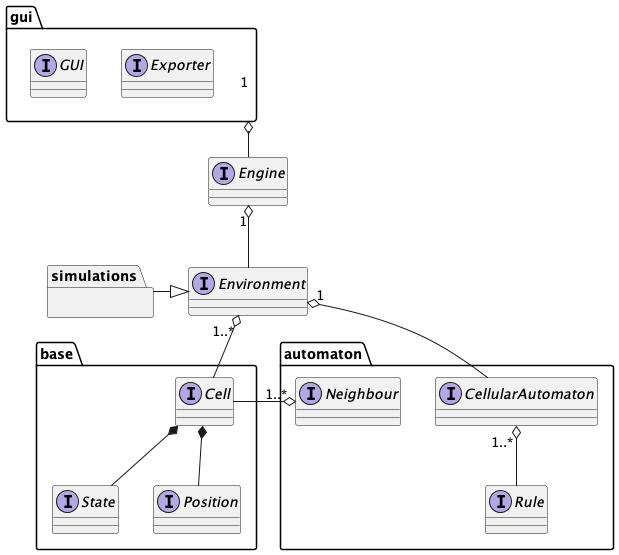

# Design Architetturale

## Descrizione ad alto livello

Il design di alto livello è riassunto nel seguente diagramma UML

Di seguito una breve descrizione per ogni componente illustrato:

- `Position` &rarr; posizione all'interno di uno spazio *D* dimensionale;
- `State` &rarr; stato che può assumere una determinata cella; generalmente uno
  stato è relativo ad una specifica simulazione, i.e. ad uno specifico automa
  cellulare.
- `Cell` &rarr; unità fondamentale all'interno dell'ambiente: ad essa è
  associata una posizione nello spazio ed uno stato;
- `CellularAutomaton` &rarr; componente che racchiude in sé l'intero
  comportamento di un automa cellulare, definito come un insieme di regole;
- `Rule` &rarr; concetto di regola, ossia una qualsiasi funzione che trasformi
  un input in un determinato output in base ad un insieme di predicati;
- `Neighbour` &rarr; insieme di celle contigue tra loro nello spazio secondo un
  certo criterio di contiguità;
- `Environment` &rarr; rappresentazione ad alto livello dell'intero spazio
  occupato da celle regolate da un comportamento definito all'interno
  dell'automa che caratterizza l'ambiente.
- `Engine` &rarr; motore del simulatore in grado di produrre e far evolvere una
  realizzazione di un automa cellulare all'interno di un ambiente.
- `GUI` &rarr; interfaccia grafica in grado di mostrare l'evoluzione di un
  automa cellulare all'interno di un ambiente.
- `Exporter` &rarr; componente in grado di esportare immagini o video della
  simulazione.
- `simulations` &rarr; all'interno di questo package saranno contenute le varie
  realizzazioni degli automi cellulari all'interno del loro ambiente.

## Pattern Architetturali

Il pattern architetturale impiegato è MVC, dove i package `base` e `automaton` insieme
ad `Environment` costituiscono il modello del simulatore, il ruolo di controller
è delegato alla componente `Engine` mentre le view saranno contenute all'interno
del package `gui`.

## Scelte Tecnologiche

Al di là dell'impiego di Scala 3.x e perciò della Java Virtual Machine, non
risulta necessario effettuare ulteriori scelte tecnologiche cruciali. Una
scelta tecnologica che non risulta complessivamente cruciale per via
dell'impiego di MVC, è la scelta del framework per la realizzazione di
interfacce grafiche (swing o scalafx), poiché la sua scelta non si riflette
minimamente sull'intero design del sistema prodotto.

[Indice](./index.md) | [Capitolo Precedente](./3-analysis.md) | [Capitolo Successivo](./5-design.md)
