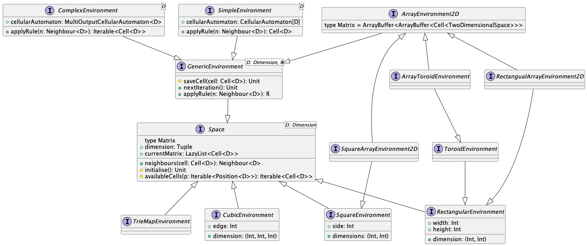
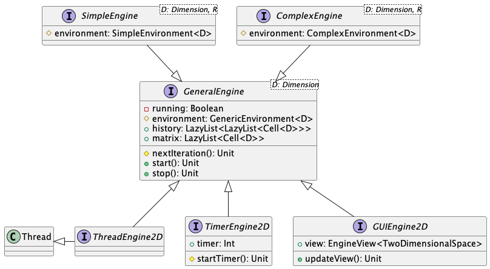

# Design di Dettaglio

Il design architetturale dell'intero sistema puo essere suddiviso in 3 macro
componenti, i quali a loro volta sono suddivisi e descritti in componenti piu
semplici che incapsulano un unico argomento. Le tre macro categorie di concetti
che compongono il sistema sono:

1. **Cellular Automaton**
2. **Environment**
3. **Engine**

L'intero sistema si basa su questi tre capisaldi, i quali compongono
principalmente le componenti di model e controller all'interno del pattern MVC:
in particlare, *Cellular Automaton* ed *Environment* fanno parte della
componente model, mentre *Engine* costituisce il controller dell'intero
applicativo. Questo rende possibile la realizzazione di molteplici componenti
view che, considerando i requisiti del sistema, può permettere la realizzazione
di un interfaccia grafica e di un esportatore video che siano unicamente
dipendenti dall'implementazione del controller.

Nelle sezioni successive verrano elencate le diverse strategie utilizzate per
sviluppare le diverse componenti, andando ad elencare le scelte effettuate
nella  realizzazione delle diverse funzionalita per far sii che sia altamente
personalizzabile, in modo da facilitare la creazione di simulazioni.

## Cellular Automaton

Il *Cellular Automaton*, puo essere visto come un contenitore di regole che
fanno riferimento ai diversi stati che compongono il Cellular Automaton stesso.
Per ogni *Cell* che viene memorizzata all'interno dell'*Environment* verrà
scelta una regola specifica, in modo da calcolare correttamente lo stato
sucessivo o gli stati successivi, a seconda del Cellular Automaton che si sta
modellando fino a quel momento (WaTor coinvolge sempre la modifca dello stato
di due celle contemporaneamente).

Il design che riguarda il *Cellular Automaton* ha richiesto una serie di scelte
importanti, affinche fosse possibile riuscire ad incapsulare la sua astrazione
in una serie di diversi componenti.

### Cell

Lo spazio di un ambiente è composto da un numero finito di celle. Ogni cella,
oltre ad avere assegnate un insieme di coordinate, ha il compito di mantenere
uno stato in un determinato istante di tempo. Lo **Stato** di una cella è
un'astrazione che dipende in base all'automa cellulare, ed esso può essere un
semplice stato "nominale" (e.g. `Dead`, `Alive`, ...) oppure può mantenere un
valore associato a quello stato (e.g. `Shark(chronon = 1, energy = 100)`,
`Fish(chronon = 1)`, ...). Per entrambi i casi, lo stato determina
l'unità fondamentale su cui si basano le regole e i comportamenti dell'automa.

Tramite quest'astrazione è possibile costruire una griglia di celle le quali
possono contenere un'informazione generica utile per la specifica del
comportamento dell'automa, mantenendo allo stesso tempo una posizione ben
definita all'interno dello spazio dell'ambiente stesso.

Nel diagramma è mostrata la struttura base delle componenti fondamentali di una
cella: una cella dipende dallo spazio dell'ambiente in cui risiede, riuscendo
così a definire una posizione all'interno di tale spazio. Successivamente, ad
una cella è assegnato uno e un solo stato.

### Neighbour

Gran parte dei comportamenti degli automi cellulari è caratterizzato dal
concetto di vicinato di una cella. In letteratura esistono vari generi di
vicinato, in particolare si ricordano il [vicinato di Moore](https://en.wikipedia.org/wiki/Moore_neighborhood)
e il [vicinato di Von Neumann](https://en.wikipedia.org/wiki/Von_Neumann_neighborhood).
Esistono però numerosi automi dove vengono impiegate strategie differenti per
l'individuazione dei vicini di una cella (e.g. *Rule110*). È quindi
fondamentale rendere il sistema capace di rappresentare sia vicinati standard
come i due sopracitati, ma allo stesso tempo permettere in modo semplice la
definizione di vicinati *custom*.

In generale, il concetto di `Neighbour` presenta due componenti principali:

1. centro: rappresenta la cella per il quale viene calcolato il vicinato;
2. vicinato: rappresenta la collezione di celle che compone il vicinato della
   cella centrale; questa collezione non fa riferimento ad una specifica regola
   con la quale individuare i vicini, dal momento in cui diversi automi
   cellulari potrebbero utilizzare regole diverse per individuare il proprio
   vicinato.

Durante il corso di questo documento e all'interno del progetto, si fa spesso
riferimento a concetti di posizione *relativa* e *assoluta*: con i due termini
si indicano due modalità differenti per esprimere le posizioni dei vicini
componenti un vicinato rispetto al centro. Nel caso in cui si parli di
posizione relativa, si intende che le posizioni assunte dai vicini saranno
relative al centro del vicinato, dove quest'ultimo si assume abbia coordinate
pari all'origine. In questo caso, per esempio, la posizione appena al di sopra
del centro in uno spazio bidimensionale assumerà coordinate relative pari a
(-1, 0), in quanto si troverà una riga precedente al centro ma sulla stessa
colonna. D'altra parte, quando si parla di posizioni assolute, queste fanno
riferimento alle coordinate assolute di tutte le celle del vicinato rispetto
l'ambiente della simulazione. Risulta quindi possibile con questa astrazione
definire una certa configurazione di un vicinato tramite posizioni relative, e
quindi individuare il vicinato stesso di una certa cella tramite il valore
delle coordinate di quest'ultima (i.e. il centro del vicinato) e i valori delle
posizioni relative.

Nel diagramma UML soprastante è mostrato come già descritto il concetto di
`Neighbour`. L'ambiente calcola un vicinato a partire da una cella che ne
costituirà il centro. Per il calcolo del vicinato, l'ambiente si avvale di un
`NeighbourhoodLocator`, il quale definisce i pattern e le configurazioni che un
determinato vicinato deve assumere, definendolo in termini di posizioni
relative. Infine, quest'ultimo espone un ulteriore metodo per il passaggio da
posizioni relative a posizioni assolute in riferimento all'ambiente.

### Rule

Il comportamento di un automa cellulare è definito attraverso un insieme di
regole, le quali prendendo in input una o più celle dell'ambiente, calcolano un
nuovo stato della cella per l'iterazione successiva. Data la natura variabile
delle regole di un automa cellulare, deve essere possibile generalizzare al
meglio il concetto di regola applicabile ad un determinato stato. Per le
considerazioni effettuate nella sezione precedente inoltre, la maggior parte
delle regole di un automa sono basate su un insieme di stati dei vicini di una
cella. Per questo motivo si è arrivati alla modellazione mostrata nel diagramma
UML sottostante.

Nel diagramma UML, `Rule` rappresenta il concetto più generico di regola, la
quale non è altro che la definizione di una funzione di trasformazione. Ogni
regola è associata ad un `matcher`, il quale rappresenta il parametro che
permette di decidere se applicare la funzione o meno. Una ragionevole
specializzazione di una regola generica è rappresentata da `NeighbourRule`, la
quale è riassumibile da una funzione che prende in input un vicinato, e se il
centro ha lo stesso stato specificato dal parametro `matcher` e il vicinato
soddisfa la regola, allora restituisce in output la nuova cella rappresentante
il nuovo centro del vicinato. `MultipleOutputRule` rappresenta una regola
generica il cui output è composto da una collezione di output, mentre
`MultipleOutputNeighbourRule` ha lo stesso obiettivo di `NeighbourRule` con la
differenze che il risultato dell'applicazione della regola è composto da un
insieme di celle. Questo può risultare utile per tutte quelle regole che
prevedono la modifica simultanea di più celle in base allo stato di un centro,
oppure per modellare il concetto di movimento di una certa entità all'interno
dello spazio (e.g. l'automa cellulare WaTor).

---

Dopo aver mostrato come sono composte le componenti fondamentali è possibile
capire di cosa si compone un automa cellulare e quali siano gli scopi e i
compiti delle sue componenti.

Ogni automa cellulare ha un comportamento più o meno complesso: risulta perciò
fondamentale astrarre in una struttura generale ogni possibile automa, e via
via raffinare il suo comportamento mediante specializzazioni sempre più
specifiche per un singolo automa.

Come mostrato nel diagramma UML, esiste un concetto genrale di automa, da cui
ereditano tutte le specializzazioni. Possiamo distinguere due macro categorie
che risultano importanti per questo elaborato:

- `CellularAutomaton` &rarr; un semplice automa cellulare, capace di mantenere
  e applicare `NeighbourRule`. Questo componente a sua volta può essere
  raffinato in due ulteriori realizzazioni:
  - `MapSingleRules` dove la collezione delle regole è rappresentata da una
     mappa da stato a regola, risultando quindi in un automa dove, per ogni
     stato esiste una ed una sola regola.
  - `MapMultipleRules` dove, essendo associato per ogni stato un insieme di
     regole, è impiegato per tutti quei casi dove per ogni stato sono associate
     più regole che possono produrre un output valido.
- `MultiOutputCellularAutomaton` &rarr; in questo caso, associato per ogni
  stato esiste una `MultipleOutputNeighbourRule`, la quale, come già
  illustrato, produce un insieme di celle in output una volta applicata ad un
  vicinato.

## Environment

Il secondo macro concetto che è costituito dalla componente `Environment`.
L'*Environment* fa sempre riferimento ad un singolo automa cellulare, ed è
responsabile del mantenimento dello stato attuale della *griglia* (l'insieme di
celle). Questo significa che l'ambiente deve poter essere in grado di
effettuare tre importanti operazioni:

- Manipolazione della griglia;
- Calcolo di un vicinato;
- Applicazione e salvataggio delle regole dell'automa cellulare sulle celle
  della griglia.

In considerazione di ciò, possiamo separare ma legare tra loro i concetti
di spazio e di ambiente inteso come manipolatore e applicatore delle regole
sulle celle componenti la griglia.

Di seguito il diagramma UML delle classi che compongono ambiente e spazio.

Di seguito una breve descrizione per le principali componenti:

- `Space` &rarr; rappresentazione dello spazio all'interno del quale risiedono
  le celle durante la simulazione. Lo spazio si compone di una griglia
  (`Matrix`), la cui struttura viene raffinata dalle implementazioni di questa
  componente, tra cui si ricordano `SquareEnvironment` e
  `RectangularEnvironment`.
- `GenericEnvironment` il quale si compone di uno spazio ed un automa
  cellulare, e definisce meccanismi con cui modificare la griglia applicando le
  regole dell'automa. Sue vere e proprie specializzazioni sono rappresentate
  da `Complex` e `Simple` *environment*, ovvero spazi che accettano rispettivamente
  `MultiOutputCellularAutomaton` e `CellularAutomaton` semplici.
- `ArrayEnvironment2D` &rarr; specializzazione di un ambiente che definisce la
  struttura dati effettiva della griglia (`Matrix`). Questa sarà la componente
  più utilizzata dagli automi sviluppati per questo elaborato, in quanto rende
  semplice la manipolazione della griglia in un ambiente bidimensionale. Di
  interessante rilievo è una sua ulteriore sotto-specializzazione per la
  rappresentazione di ambienti Toroidali.

L'uso di questa grande mole di specializzazioni verrà illustrato in dettaglio
nel capitolo riguardante [l'implementazione](./6-implementation.md).

## Engine

L'ultimo componente appartenente al cuore del sistema software è il motore del
simulatore. Suo compito è quello di mantenere, interrogare e richiedere la
modifica di un `Environment`. Come precedentemente illustrato, esistendo una
grande quantità di tipologie di ambiente, l'implementazione del motore dovrebbe
essere agnostica rispetto l'istanza di ambiente assegnatagli.

Un ulteriore compito del motore è quello di scandire le iterazioni della
simulazione stessa, siano esse potenzialmente infinite e interrompibili da un
utente, oppure ben definite al momento della creazione del motore.

Infine, essendo il motore ciò che rende possibile l'evolversi di un automa
cellulare nel tempo, costituisce uno dei principali fattori di attenzione alle
prestazioni, e la sua implementazione dovrebbe tenere in considerazione il
requisito non funzionale di prestazioni sufficientemente elevate per le
simulazioni richieste.

Dal momento in cui possono esserci diverse modalità con la quale voler eseguire
la simulazione (e.g. visualizzazione real time con GUI, simulazione con
output finale un video, ...) è necessario creare concetti generali di un `Engine`,
che via via vengono raffinati in implementazioni capaci di adattarsi al meglio
per la specifica modalità d'esecuzione.

In base al design desiderato e ai [requisiti elencati](./3-analysis.md), si è
arrivati al seguente modello.

In base alla tipologia di `Environment`, esistono le corrispettive specializzazioni
del motore; è presente inoltre un'ulteriore specializzazione per i casi di ambienti
bidimensionali che fanno utilizzo di griglie iterabili: `IterableEngine2D`. Questo
motore si occupa di generalizzare il concetto di salvataggio e interrogazione della
griglia. Quanto dichiarato nei paragrafi precedenti ha portato lo sviluppo di ulteriori
specilizzazioni di quest'ultimo motore, in particolare:

1. `GUIEngine2D` &rarr; motore in grado di permettere l'aggancio di
   un'interfaccia grafica in tempo reale.
2. `IterableTimerEngine2D` &rarr; motore con un numero di step finiti (utile
   per la generazione di video/immagini ).
3. `IterableThreadEngine2D` &rarr; versione ad alte prestazioni e *thread-safe*
   del motore.

## Design Interfaccia Grafica

[TODO: VINCI]

[Indice](./index.md) | [Capitolo Precedente](./4-high-level-design.md) | [Capitolo Successivo](./6-implementation.md)
