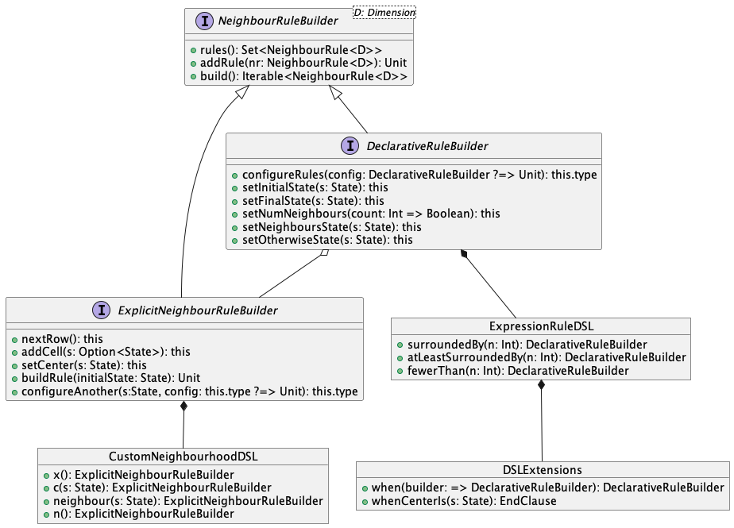

# Implementazione del Sistema

## Assegnazione del lavoro

Di seguito le iniziali dei cognomi dei membri saranno affiancate ad ogni capitolo per il
quale si ritiene/ritengono maggiormente responsabile/i gli studenti coinvolti.

- V &rarr; Vincenzi Fabio
- I &rarr; Iorio Matteo
- F &rarr; Furi Stefano

- [Implementazione del Sistema](#implementazione-del-sistema)
  - [Cellular Automaton](#cellular-automaton) V-I-F
    - [Cell](#cell) I-F
      - [State](#state) I-F
    - [Rule](#rule) F
      - [Domain Specific Language per la costruzione di `NeighbourRule`](#domain-specific-language-per-la-costruzione-di-neighbourrule) F
  - [Environment](#environment) I-V
    - [Configurazione tramite Mixin](#configurazione-tramite-mixin) I
    - [Space](#space) I-F
    - [Tipologie di Space](#tipologie-di-space) I
    - [Implementations](#implementations) V-I-F
  - [Engine](#engine) V-I
  - [Interfaccia Grafica](#interfaccia-grafica) V

In generale, tutti i componenti del gruppo hanno lavorato cooperando
e in maniera simultanea allo sviluppo dell'intera parte del modello
di base del simulatore.

---

All'intero di questo capitolo verranno descritte le modalita attraverso la
quale sono state definite le varie classi, gli eventuali problemi riscontrati
ed infine le modalita attraverso la quale queste difficolta sono state risolte.

## Cellular Automaton

Uno dei primi concetti che e stato sviluppato, riguarda il *Cellular
Automaton*. Le classi sviluppate per la realizzazione del *Cellular Automaton*,
sono diverse e possono essere elencate qui di seguito:

1. *Cellular Automaton*
2. *Dimension*
3. *Cell*
4. *Neighbour*
5. *Rule*

Le seguenti classi qui sopra elencate, ad esclusione di *Dimension*, sono
racchiuse all'intero del *package*: *domain.automaton*, dove al suo interno
sono contenute tutte le componenti software a supporto del concetto di automa
cellulare.

Dal momento in cui esistono diverse categorie di *Cellular Automaton*, tra cui
una specifica categoria la quale per un singolo stato di una *Cell* potrebbero
venire applicate piu di una regola contemporaneamente, si e deciso di
utilizzare un *type parameter* per la definizione della struttura dati nella
quale andare a memorizzare le diverse regole che compongono il *Cellular
Automaton*. A supporto di questa funzionalita inoltre si e deciso di
implementare, tramite l'utilizzo di *mixin*, diverse strutture dati gia
funzionanti da utilizzare per memorizzare lavorare su tali regole.

Di seguito sono presentate le classi che ritieniamo siano degne di un
approfondimento implementativo, rispetto a quanto precedentemente
descritto nel [capitolo di design](./5-design.md).

### Cell

Uno dei componenti fondamentali per un *Cellular Automaton* e il concetto di
*Cell*. La realizzazione di questo componente ha previsto la definizione di un
nuovo *trait* denominato **Cell**, tale *trait* e definito generico nella
dimensione dal momento in cui una *Cell* deve far riferimento ad una
dimensionalita dello spazio generica, per definire cio e stato necessario
forzare il parametro generico come sotto classe del *trait Dimension*. In
questo modo si ha la garanzia che *Cell* ed *Cellular Automaton* facciano
riferimento allo stesso tipo di dimensione dello spazio.

Una delle componenti principali di *Cell* e la posizione che assumoe nello
pazio, rappresentato dal valore *position*, Tale posizione e definita anch'essa
generica nella dimensione **D** dello spazio. Inoltre la *Cell* e
caratteriizzata da uno stato che ha in un preciso istante di tempo. Per
modellare lo stato e stato definito un nuovo parametro denominato *state* di
tipo *State*.

```scala
trait Cell[D <: Dimension]:
    def position: Position[D]
    def state: State
object Cell:
    def apply[D <: Dimension](p: Position[D], s: State): Cell[D] = CellImpl(p, s)
    def unapply[D <: Dimension](cell: Cell[D]): Option[(Position[D], State)] = Some((cell.position, cell.state))
    private case class CellImpl[D <: Dimension]
      (override val position: Position[D], override val state: State)
    extends Cell[D]
```

Dopo la definizione del *trait* si e passati allo sviluppo dell'*object Cell*
il cui compito e quello di fornire una *factory* per le *Cell*. Oltre a ciò è
stata definita una *case class* che implementasse il *trait Cell*, in modo da
fornire una sua implementazione da utilizzare durante lo sviluppo delle
simulazioni.

#### State

Nella maggior parte dei casi, la definizione di uno stato è semplicemente
rappresentata da un *product type*, ossia un'enumerazione. Per altri casi, come
per esempio gli stati dell'automa cellulare WaTor, è necessario mantenere
un'insieme di informazioni all'interno di uno stato. In questo modo, lato
`Environment` non si dev'essere a conoscenza dei dettagli implementativi dello
stato (difatti trattato come un semplice `State`) e solo dal lato della
definizione delle regole è possibile manipolare l'informazione trattenuta dallo
stato.

Per questo motivo è stato esteso lo stato ad un generico stato con valore:

```Scala
trait ValuedState[T]:
  def value: T
  def update(f: T => T): ValuedState[T] =
    val v: T = f(value)
    new ValuedState[T] { override def value: T = v}
```

Il valore trattenuto può rappresentare un qualsiasi oggetto, e una comoda
funzione `update` permette di mantenere applicare una trasformazione al valore
mantenuto, garantendo l'immutabilità degli oggetti.

>Nota: l'impiego di tale stato richiede una corretta definizione di una
>funzione
di comparazione tra gli stati. Essendo uno stato generico un'enumerazione, la
funzione `equals` è sufficiente a discriminare stati diversi. Nel caso di un
`ValuedState` potrebbe essere necessario escludere il valore trattenuto
nell'atto di comparazione. Per esempio, per l'automa WaTor è stato definito
un *trait* che permette di comparare solo grazie all'istanza della classe,
e successivamente esteso per gli stati *Shark* e *Fish*:
```Scala
sealed trait StateComparison:
  override def equals(x: Any) = x.getClass() == this.getClass()
```

### Rule

Come già illustrato nel capitolo riguardante il Design, una `Rule` non è altro
che l'applicazione di una funzione rispetto ad un particolare `matcher`.
Ogni automa cellulare sviluppato per questo progetto, prevede l'impiego
di una regola che si basi su vicinati, perciò il `matcher` sarà rappresentato
da uno specifico `State`, e la funzione di trasformazione accetta in input
un vicinato e restituisce il nuovo centro di quel vicinato. Negli automi
cellulari che richiedono di modellare un concetto di movimento (i.e. Langton's
Ant e WaTor), si impiega la specializzazione `MultipleOutputNeighbourRule`,
la quale restituisce sempre zero o due celle in output: la prima cella rappresenta
la nuova cella dopo aver effettuato lo spostamento, mentre la seconda cella
rappresenta la cella precedente lo spostamento.

#### Domain Specific Language per la costruzione di `NeighbourRule`

Essendo `Rule` il cuore di ogni automa cellulare, risulta necessario costruire
meccanismi e astrazioni in grado di rendere la creazione di tali regole nella
maniera più semplice e intuitiva possibile. Grazie alle capacità di Scala, è
stato possibile define un Domain Specific Language (DSL) in grado di creare
semplici `NeighbourRule` in maniera dichiarativa.



In figura è illustrato come interagiscono tra di loro le componenti del DSL.
Due specializzazioni sono state sviluppate di `NeighbourRuleBuilder`:

1. `DeclarativeNeighbourRuleBuilder`: permette la creazione di semplici regole
   costruendo predicati sulla cardinalità dei vicini aventi un certo stato.
2. `ExplicitNeighbourRuleBuilder`: costruisce `NeighbourRule` permettendo di
   specificare l'esatta configurazione che deve avere il vicinato.

Come suggerisce il nome, entrambe le componenti implementano il pattern
**Builder**, ma la chiamata dei metodo del builder dovrebbe avvenire solo
grazie agli oggetti che espongono il DSL vero e proprio.

Di seguito due esempi dell'impego delle due diverse modalità di costruzione
delle regole.

```Scala
DeclarativeRuleBuilder.configureRules:
  DEAD when fewerThan(2) withState ALIVE whenCenterIs ALIVE
  ALIVE when surroundedBy(2) withState ALIVE whenCenterIs ALIVE
  ALIVE when surroundedBy(3) withState ALIVE whenCenterIs ALIVE
  DEAD when atLeastSurroundedBy(4) withState ALIVE whenCenterIs ALIVE
  ALIVE when surroundedBy(3) withState ALIVE whenCenterIs DEAD
```

Nello snippet di codice sopra, vengono specificate le regole dell'automa
Game of Life. Ogni riga contiene una specifica regola e ogni regola inizia
con lo stato che assumerà l'automa in caso la regola venga applicata con successo.
Successivamente, con la keyword `when` si può configurare la composizione
del vicinato. Nell'esempio sopra, è illustrato come sia possibile specificare:

1. un **limite superiore** di vicini &rarr; `fewerThan`
2. un numero **esatto** di vicini &rarr; `surroundedBy`
3. un **limite inferiore** di vicini &rarr; `atLeastSurroundedBy`

Successivamente è quindi necessario specificare quale stato debbano avere i
vicini, ed opzionalmente il raggio di ricerca dei vicini (keyword non mostrata
nell'esempio `withRadius`, di default a 1 con vicinato di Moore).
Successivamente, è opzionale specificare lo stato del centro per cui la regola
venga applicata, ossia il `matcher` della regola. Se non viene specificato, la
regola si riferisce a qualunque stato. È infine opzionale specificare uno stato
alternativo (keyword `otherwise` al termine della regola) in caso in cui la
regola non possa essere applicata per mancata corrispondenza con il vicinato.
Se non viene specificato, il caso alternativo è costituito dal centro del
vicinato in input inalterato.

Il DSL così dichiarato, permette di costruire un insieme di regole semplici
adatte per modellare automi come Game of Life o Brian's Brain.

È possibile inoltre costruire configurazioni custom di vicinati tramite un
estensione del `NeighbourRuleBuilder`, impiegata attraverso composizione
all'interno del `DeclarativeRuleBuilder`.


Come illustrato in figura, si considerino le regole che costituiscono l'automa Rule110.

Tramite l'impiego per composizione di `ExplicitNeighbourRuleBuilder` all'interno
del builder dichiarativo è possibile specificare le regole in modo immediato tramite:

```Scala
DeclarativeRuleBuilder.configureRules:
  White whenNeighbourhoodIsExactlyLike:
    neighbour(Black) | c(Black) | neighbour(Black)
  Black whenNeighbourhoodIsExactlyLike:
    neighbour(Black) | c(Black) | neighbour(White)
  Black whenNeighbourhoodIsExactlyLike:
    neighbour(Black) | c(White) | neighbour(Black)
  White whenNeighbourhoodIsExactlyLike:
    neighbour(Black) | c(White) | neighbour(White)
  Black whenNeighbourhoodIsExactlyLike:
    neighbour(White) | c(Black) | neighbour(Black)
  Black whenNeighbourhoodIsExactlyLike:
    neighbour(White) | c(Black) | neighbour(White)
  Black whenNeighbourhoodIsExactlyLike:
    neighbour(White) | c(White) | neighbour(Black)
  White whenNeighbourhoodIsExactlyLike:
    neighbour(White) | c(White) | neighbour(White)
```

Come per l'esempio precedente, una regola inizia sempre con lo stato che il
centro del vicinato assumerà se la regola viene applicata con successo.
Successivamente viene definito il vicinato attraverso la seguente sintassi:

- `neighbour(s: State)`: si specifica un vicino con lo stato in input. La sua
  posizione dipenderà dove verrà posizionato il centro all'interno della regola
  corrente;
- `c(s: State)`: posizionamento del centro della regola con stato iniziale pari
  allo stato dato in input (i.e. il `matcher` della regola);
- `|`: separatore di celle;
- `x`: *placeholder* per indicare un vicino da ignorare;
- `| n |`: carattere di nuova linea.

L'intera sintassi può essere osservata con il seguente esempio:

```Scala
DeclarativeRuleBuilder.configureRules:
  Alive whenNeighbourhoodIsExactlyLike:
    neighbour(Alive) | x       | neighbour(Alive) | n |
    x                | c(Dead) | x                | n |
    neighbour(Alive) | x       | neighbour(Alive)
```

dove, se il centro ha stato `Dead` e il suo vicinato assume il pattern indicato
(vicini diagonali con stato `Alive`), allora il nuovo centro assumerà stato
`Alive`.

Per la modellazione dell'automa cellulare Brian's Brain, è possibile osservare
gran parte della sintassi del DSL costruito:

```Scala
DeclarativeRuleBuilder.configureRules:
  DYING whenNeighbourhoodIsExactlyLike(c(ON))
  ON when surroundedBy(2) withState ON whenCenterIs OFF otherwise OFF
  OFF whenNeighbourhoodIsExactlyLike(c(DYING))
```

---
Dopo aver costruito un DSL per la creazione regole di automa cellulare in
maniera dichiarativa, è stata creato un semplice *builder* per automi cellulari
che impiegano tale sintassi. In questo modo è possibile creare un semplice
`CellularAutomaton` in uno spazio bidimensionale tramite:

```Scala
CellularAutomatonBuilder.fromRuleBuilder:
  DeclarativeRuleBuilder.configureRules:
    dead when fewerThan(2) withState alive whenCenterIs(alive)
    alive when surroundedBy(2) withState alive whenCenterIs(alive)
    alive whenNeighbourhoodIsExactlyLike:
      neighbour(alive) | c(dead) | neighbour(dead)
```

## Environment

Il secondo macro componente che e stato necessario sviluppare e
l'*Environment*. Questo componente software incapsula lo spazio all'interno
della quale vengono memorizzate le *Cell* di un *Cellular Automaton*. Per
modellare questa astrazione nel tipo di simulazione che si vuole implementare,
e stato necessario fare in modo che l'intero *Environment* fosse generico nel
tipo di *Cellular Automaton* che si sta utilizzando. Per fare in modo di avere
una rappresentazione generale dell'ambiente, e stato realizzato il *trait
Generic Environment*, il quale e definito in due campi generici, il primo fa
riferimento alla *Dimension* della simulazione, mentre il secondo generico
riguarda il tipo di ritorno dopo l'applicazione di una specifica regola.

```scala
trait GenericEnvironment[D <: Dimension, R] extends Space[D]:
  protected def saveCell(cells: Cell[D]*): Unit
  def applyRule(neighbors: Neighbour[D]): R
```

La definizione di questo *Environment* permette all'utente di applicare una
determinata regola dato uno specifico *Neighbour* per poi sucessivamente
salvare il risulato all'intero della struttura dati che si occupa di mantenere
tutte le celle della simulazione.

### Configurazione tramite Mixin

La modellazione dello spazio tramite il *type* ha reso possibile l'utilizzo dei
*Mixin*. La configurazione della struttura dati con la quale modellare lo
spazio e definito tramite uno o piu trait che vanno a comporre il *Cake
Pattern*, attraverso il quale vengono configurate le diverse informazioni
dell'*Environment*.

Questo meccanismo viene in oltre utilizzato per modellare la geometria dello
spazio del *Cellular Automaton*. Ovvero ogni *Cellular Automaton* ha la propria
concezione di spazio, ad esempio un semplice rettangolo, o uno spazio piu
complesso come quello toroidale. Anche per ls modellazione di questo
comportamento dell'*Environment* vengono utilizzati i *Mixin* attraverso cui e
possibile specificare i diversi comportamenti riguardanti lo spazio geometrico
ed inoltre le varie modalita con la quale percepire lo spazio stesso.

### Space

Come formulato in precedenza, e fondamentale avere all'interno di una
simulazione una strtuttura dati al cui interno vengono memorizzate tutte le
*Cell* inerenti ad una simulazione. Per la rappresentazione di questo
particolare aspetto si e sviluppato uno specifico *trait* all'interno
dell'*Environment* denominato *Space* generico nella dimensione. La dimensione
dello spazio e dell'automa cellulare sara sempre la stessa dal momento in cui
vengono definite tramite lo stesso generico in input all'*Environment*.

```scala
trait Space[D <: Dimension]:
   type Matrix
   def currentMatrix: Matrix
   def matrix: Matrix
   def neighbours(cell: Cell[D]): Neighbour[TwoDimensionalSpace]
   def dimension: Tuple
   protected def initialise(): Unit
   protected def availableCells(positions: Iterable[Position[D]]): Iterable[Cell[D]]
```

Dal momento in cui non e possibile sapere in anticipo il tipo di dimensione, la
struttura dati all'interno della quale verranno memorizzate le *Cell* e
definita tramite un *type* in questo modo lo user avra libera scelta nella
tipologia di struttura dati da utilizare. Questo *trait* in oltre si occupa
anche di andare a definire alcune operazioni di utility per lavorare sulla
struttura dati utilizzata. Uno dei passaggi fondamentali per una qualsiasi
simulazione riguarda l'inizializzazione dello spazio. Proprio per questo e
stato definito il metodo *initialise*, al cui interno verra definita lo stato
iniziale della simulazione.

### Tipologie di Space

Come descritto in precedenza, un automa cellulare ha il proprio spazio in cui
evolve, lo spazio potrebbe essere rappresentato da un semplice rettangolo
dimensionale, a forme molto piu complesse come quelle di cubi e toroidi. Per
rappresentare questa diversita di struttura dell'*Environment* sono state
definite una serie di *trait* che possono rappresentare diverse strutture
spaziali da utilizzare nella simulazione.

```scala
trait SquareEnvironment extends Space[TwoDimensionalSpace]:
    def side: Int
    override def dimension: Tuple2[Int, Int] = (side, side)
trait CubicEnvironment extends Space[ThreeDimensionalSpace]:
    def edge: Int
    override def dimension = (edge, edge, edge)
trait RectangularEnvironment extends Space[TwoDimensionalSpace]:
    def width: Int
    def heigth: Int
    override def dimension: Tuple2[Int, Int] = (heigth, width)
trait ToroidEnvironmnt extends RectangularEnvironment:
  extension (dividend: Int)
    infix def /%/(divisor: Int): Int = 
      val result = dividend % divisor
      result match
        case value if value < 0 => result + divisor
        case * => result
```

I *trait* qui sopra definiti permettono di modellare uno specifico *Space* da
utilizzare per una simulazione. Questo tipo di modellazione permette di
introdurre concetti specifici caratteristici per un certo tipo di *Space*, come
nel caso di uno spazio toroidale il quale puo essere visualizzato come un
rettangolo in uno spazio bidimensionale. Questo tipo di visione permette di
introdurre specifici metodi da utilizzare per modellare lo spazio
correttamente.

### Cellular Automaton's Type

ADD mixin

### Space

### Implementations


## Engine

## Interfaccia Grafica

[Indice](./index.md) | [Capitolo Precedente](./5-design.md) | [Capitolo Successivo](./7-conclusions.md)
